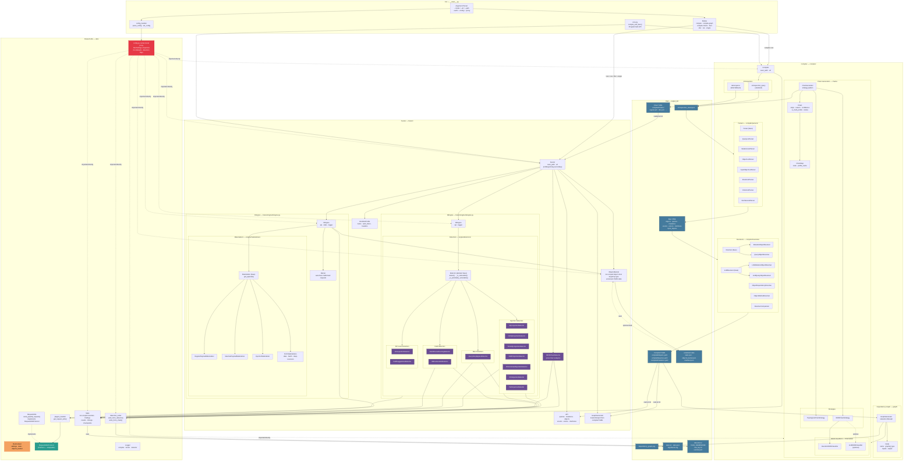

# GraphQLer Architecture

## Overview

GraphQLer is split into two sequential phases — **Compilation** and **Fuzzing** — connected by files on disk. The compiler produces YAML/JSON artifacts that the fuzzer reads at startup. Neither phase holds a direct reference to the other at runtime.

---

## Architecture Diagram


```mermaid
flowchart TD
    subgraph CLI["CLI — __main__.py"]
        ARGS["Argument Parser\n--mode / --url / --path\n--auth / --config / --proxy"]
        CONFIG_HANDLER["config_handler\nparse_config · set_config"]
        MODES["Modes\ncompile · compile-graph\ncompile-chains · fuzz\nidor · run · single"]
        CORE["core.py\ncompile_and_fuzz()\nProgrammatic API"]
    end

    subgraph COMPILER["Compiler — compiler/"]
        COMPILER_MAIN["Compiler\nsave_path · url"]

        subgraph INTROSPECT["Introspection"]
            INTRO_QUERY["introspection_query\n(standard)"]
            CLAIRV["clairvoyance\n(blind fallback)"]
        end

        subgraph PARSERS["Parsers — compiler/parsers/"]
            PARSER_BASE["Parser (base)"]
            QLP["QueryListParser"]
            MLP["MutationListParser"]
            OLP["ObjectListParser"]
            IOLP["InputObjectListParser"]
            ELP["EnumListParser"]
            ULP["UnionListParser"]
            ILP["InterfaceListParser"]
        end

        subgraph RESOLVERS["Resolvers — compiler/resolvers/"]
            RES_BASE["Resolver (base)"]
            ODR["ObjectDependencyResolver"]
            OMR["ObjectMethodResolver"]
            MOR["MutationObjectResolver"]
            QOR["QueryObjectResolver"]
            LLM_RES["LLMResolver (base)"]
            LLM_MOR["LLMMutationObjectResolver"]
            LLM_QOR["LLMQueryObjectResolver"]
            RES_CMP["ResolverComparison"]
        end

        subgraph GRAPH_GEN["Dependency Graph — graph/"]
            GRAPH_GENERATOR["GraphGenerator\nnetworkx.DiGraph"]
            NODE["Node\nname · graphql_type\ninputs · output"]
        end

        subgraph CHAIN_GEN["Chain Generation — chains/"]
            CG["ChainGenerator\nstrategy pattern"]
            subgraph STRATEGIES["Strategies"]
                TOPO["TopologicalChainStrategy"]
                IDOR_STRAT["IDORChainStrategy"]
            end
            subgraph IDOR_CLASS["IDOR Classifiers — chains/idor/"]
                HEUR["HeuristicIDORClassifier"]
                LLM_IDOR["LLMIDORClassifier\n(optional)"]
            end
            CHAIN["Chain\nsteps · reason · confidence\nis_multi_profile · nodes"]
            CHAIN_STEP["ChainStep\nnode · profile_name"]
        end
    end

    subgraph DISK["Disk — output_dir/"]
        direction LR
        YAML_RAW["Raw YAML\nobjects · queries · mutations\nenums · unions · interfaces\ninput_objects"]
        YAML_COMPILED["Compiled YAML\ncompiled/objects.yaml\ncompiled/queries.yaml\ncompiled/mutations.yaml"]
        CHAINS_YAML["Chain YAML\ncompiled/chains/\n  regular.yml · idor.yml · ..."]
        GRAPH_PNG["dependency_graph.png"]
        INTROSPECTION_JSON["introspection_result.json"]
        STATS_FILES["stats.txt · stats.json\nlogs/fuzzer.log"]
        OBJECTS_PKL["serialized state\nstats.json · objects_bucket.json\nmanifest.json"]
        DETECTIONS_DIR["detections/\n  VULN_NAME/NODE/\n    raw_log.txt\n    summary.txt"]
    end

    subgraph FUZZER["Fuzzer — fuzzer/"]
        FUZZER_MAIN["Fuzzer\nsave_path · url\nprofiles{primary,secondary}"]
        API_OBJ["API\nqueries · mutations · objects\nenums · unions · interfaces"]
        GRAPH_LOAD["GraphGenerator\nloads DiGraph from compiled YAML"]
        OBJECTS_BUCKET["ObjectsBucket\nrun-scoped object store keyed by type\nversioned JSON state"]

        subgraph FENGINE["FEngine — fuzzer/engine/fengine.py"]
            FENGINE_MAIN["FEngine\napi · stats · logger"]
            subgraph MATERIALIZERS["Materializers — engine/materializers/"]
                MAT_BASE["Materializer (base)\nget_payload()"]
                REG_MAT["RegularPayloadMaterializer"]
                MAX_MAT["MaximalPayloadMaterializer"]
                INJ_MAT["InjectionMaterializer"]
                DOS_MAT["DoS Materializers\nalias · batch · deep-recursion"]
            end
            RETRIER["Retrier\nauto-fixes malformed requests"]
        end

        subgraph DENGINE["DEngine — fuzzer/engine/dengine.py"]
            DENGINE_MAIN["DEngine\napi · logger"]
            subgraph DETECTORS["Detectors — engine/detectors/"]
                DET_BASE["Detector (abstract base)\ndetect() · _is_vulnerable()\n_is_potentially_vulnerable()"]
                subgraph INJ_DETS["Injection Detectors"]
                    SQL_DET["SQLInjectionDetector"]
                    NOSQL_DET["NoSQLInjectionDetector"]
                    TSQL_DET["TimeSQLInjectionDetector"]
                    SSRF_DET["SSRFInjectionDetector"]
                    OS_DET["OSCommandInjectionDetector"]
                    XSS_DET["XSSInjectionDetector"]
                    PATH_DET["PathInjectionDetector"]
                end
                subgraph MISC_DETS["Misc Detectors"]
                    QDB_DET["QueryDenyBypassDetector"]
                end
                subgraph FIELD_DETS["Field Detectors"]
                    FCF_DET["FieldCharsetFuzzingDetector"]
                    IDE_DET["IDEnumerationDetector"]
                end
                subgraph API_DETS["API-Level Detectors"]
                    INTRO_DET["IntrospectionDetector"]
                    FS_DET["FieldSuggestionsDetector"]
                end
            end
        end

        IDOR_CHAIN_DET["IDORChainDetector\n(post-chain analysis)"]
        PROFILES["RuntimeProfile\nname · auth_token · headers"]
    end

    subgraph UTILS["Shared Utils — utils/"]
        STATS["Stats\nrun-scoped counters · findings\nresults · timings · checkpoints"]
        RUN_CONTEXT["RunContext\nsettings · stats · objects_bucket"]
        PLUGINS_HDR["plugins_handler\nget_request_utils()"]
        REQUEST_UTILS["RequestUtils\nsend_graphql_request()\nimplements RequestUtilsProtocol"]
        REQ_PROTO["RequestUtilsProtocol\n(interface — swappable)"]
        DET_WRITER["detection_writer\nwrite_from_detector()\nwrite_from_chain()"]
        LOGGER["Logger\ncompiler · fuzzer · detector"]
        CONFIG["config.py context-local proxy\nRunSettings snapshots\nCLI defaults · detection flags"]
    end

    %% ── CLI wiring ──────────────────────────────────────────────
    ARGS --> CONFIG_HANDLER --> CONFIG
    ARGS --> MODES
    MODES -->|"compile / run"| COMPILER_MAIN
    MODES -->|"fuzz / run / idor / single"| FUZZER_MAIN
    CORE --> COMPILER_MAIN
    CORE --> FUZZER_MAIN

    %% ── Compiler pipeline ────────────────────────────────────────
    COMPILER_MAIN --> INTROSPECT
    INTRO_QUERY --> INTROSPECTION_JSON
    CLAIRV --> INTROSPECTION_JSON
    INTROSPECTION_JSON --> PARSERS
    PARSERS --> YAML_RAW
    YAML_RAW --> RESOLVERS
    RES_BASE --> MOR & QOR
    LLM_RES --> LLM_MOR & LLM_QOR
    RESOLVERS --> YAML_COMPILED
    YAML_COMPILED --> GRAPH_GENERATOR
    GRAPH_GENERATOR --> NODE
    GRAPH_GENERATOR --> GRAPH_PNG
    GRAPH_GENERATOR --> CHAIN_GEN
    CG --> TOPO & IDOR_STRAT
    IDOR_STRAT --> HEUR
    IDOR_STRAT -.->|optional| LLM_IDOR
    CG --> CHAIN --> CHAIN_STEP
    CG --> CHAINS_YAML

    %% ── Fuzzer startup (reads disk) ──────────────────────────────
    YAML_COMPILED -->|read at init| API_OBJ
    YAML_COMPILED -->|read at init| GRAPH_LOAD
    CHAINS_YAML -->|loaded at init| FUZZER_MAIN
    OBJECTS_PKL -.->|optional load| OBJECTS_BUCKET

    %% ── Fuzzer runtime ───────────────────────────────────────────
    FUZZER_MAIN --> FENGINE_MAIN & DENGINE_MAIN & IDOR_CHAIN_DET
    FUZZER_MAIN --> API_OBJ & GRAPH_LOAD & OBJECTS_BUCKET
    FUZZER_MAIN --> PROFILES

    FENGINE_MAIN --> MAT_BASE
    MAT_BASE --> REG_MAT & MAX_MAT & INJ_MAT & DOS_MAT
    FENGINE_MAIN --> RETRIER
    FENGINE_MAIN --> OBJECTS_BUCKET

    DENGINE_MAIN --> DET_BASE
    DET_BASE --> INJ_DETS & MISC_DETS & FIELD_DETS & API_DETS
    INJ_DETS & MISC_DETS & FIELD_DETS --> STATS
    INJ_DETS & MISC_DETS & FIELD_DETS --> DET_WRITER

    IDOR_CHAIN_DET --> STATS
    IDOR_CHAIN_DET --> DET_WRITER

    %% ── Output ───────────────────────────────────────────────────
    STATS -->|save| STATS_FILES
    OBJECTS_BUCKET -->|save| OBJECTS_PKL
    DET_WRITER --> DETECTIONS_DIR

    %% ── Shared utils wiring ──────────────────────────────────────
    PLUGINS_HDR --> REQ_PROTO
    REQUEST_UTILS -.->|implements| REQ_PROTO
    COMPILER_MAIN & FENGINE_MAIN & DETECTORS --> PLUGINS_HDR

    %% ── Context-local config proxy (dashed implicit dependencies) ────────────
    CONFIG -.->|imported directly| COMPILER_MAIN
    CONFIG -.->|imported directly| FUZZER_MAIN
    CONFIG -.->|imported directly| FENGINE_MAIN
    CONFIG -.->|imported directly| DENGINE_MAIN
    CONFIG -.->|imported directly| STATS
    CONFIG -.->|imported directly| OBJECTS_BUCKET
    CONFIG -.->|imported directly| DET_WRITER
    CONFIG -.->|imported directly| CHAIN_GEN

    %% ── Styles ───────────────────────────────────────────────────
    classDef context fill:#f4a261,stroke:#e76f51,color:#000
    classDef implicit_dependency fill:#e63946,stroke:#c1121f,color:#fff
    classDef interface fill:#2a9d8f,stroke:#21867a,color:#fff
    classDef disk fill:#457b9d,stroke:#1d3557,color:#fff
    classDef detector fill:#6a4c93,stroke:#4a3770,color:#fff

    class RUN_CONTEXT context
    class CONFIG implicit_dependency
    class REQ_PROTO interface
    class YAML_RAW,YAML_COMPILED,CHAINS_YAML,INTROSPECTION_JSON,STATS_FILES,OBJECTS_PKL,DETECTIONS_DIR,GRAPH_PNG disk
    class SQL_DET,NOSQL_DET,TSQL_DET,SSRF_DET,OS_DET,XSS_DET,PATH_DET,QDB_DET,FCF_DET,IDE_DET,INTRO_DET,FS_DET,IDOR_CHAIN_DET detector
```

---

## Coupling Analysis

### ✅ Well-Decoupled

| Boundary | Mechanism | Notes |
|---|---|---|
| Compiler ↔ Fuzzer | **Files on disk** | Zero runtime coupling — compiler writes YAML/JSON, fuzzer reads them at startup. Can be run years apart. |
| HTTP layer | **`RequestUtilsProtocol`** | All network I/O goes through a protocol interface. Plugins can replace the entire HTTP implementation without touching core logic. |
| Chain strategies | **`BaseChainStrategy`** | `TopologicalChainStrategy` and `IDORChainStrategy` are swappable; adding a new traversal strategy requires no changes to `ChainGenerator`. |
| Detectors | **`Detector` abstract base** | All detectors share a uniform `detect()` interface. `DEngine` iterates a list — adding a new detector is a one-liner in `__init__.py`. |
| Materializers | **`Materializer` base class** | Payload generation strategies are interchangeable. `FEngine` selects the right materializer by type. |
| Programmatic API | **`core.py`** | Clean facade hiding the full compiler+fuzzer pipeline behind `compile_and_fuzz()`. |

---

### ⚠️ Tightly Coupled

| Coupling | Location | Impact |
|---|---|---|
| **Context-local config proxy** | Engine and detector modules still import `config` directly | Runs are isolated through `RunSettings` + `config.activate()`, but dependencies remain implicit and require an active context. |
| **`plugins_handler.get_request_utils()`** | Called as a module-level function from compiler, fengine, detectors | The HTTP implementation remains process-global. Dynamic plugin selection and logger capture keep MCP tool execution serialized. |
| **`API` artifact loading** | `Fuzzer → API(url, save_path)` reads compiled YAML during construction | `manifest.json` now validates completeness, phase, version, endpoint, and hashes first; loading remains eager by design. |
| **File-backed reports/state** | `Stats` and `ObjectsBucket` own paths below one run directory | Each run has isolated paths and atomic JSON checkpoints, but storage is intentionally local-filesystem-only. |

---

## Data Flow Summary

```
Target GraphQL API
       │  ← HTTP introspection
       ▼
  Introspection JSON
       │  ← parse (7 parsers)
       ▼
  Raw YAML (objects / queries / mutations / …)
       │  ← resolve dependencies (heuristic + optional LLM)
       ▼
  Compiled YAML  +  dependency_graph.png
       │  ← graph traversal (topological + IDOR strategies)
       ▼
  chains.yaml
       │
  ─────┼─────── COMPILER DONE — FUZZER STARTS ────────────────
       │
       ▼
  Fuzzer reads: compiled YAML → API object
                chains.yaml   → list[Chain]
                DiGraph       → island-node discovery
       │
       ├── For each Chain:
       │     FEngine runs each ChainStep with its RuntimeProfile
       │     ObjectsBucket accumulates returned objects
       │     DEngine runs detectors per node
       │     IDORChainDetector analyses multi-profile results
       │
       ├── DEngine runs API-level detectors (introspection, field suggestions)
       │
       └── Stats.save() + ObjectsBucket.save() + detection_writer → files
              │
              ▼
       stats.txt · stats.json · serialized/*.json · manifest.json · logs/ · detections/
```

---

## Design Patterns in Use

| Pattern | Where | Notes |
|---|---|---|
| **Strategy** | `ChainGenerator` + `BaseChainStrategy` | `TopologicalChainStrategy` / `IDORChainStrategy` are swappable |
| **Template Method** | `Detector` abstract base | Subclasses implement `_is_vulnerable()` / `_is_potentially_vulnerable()`; base handles the rest |
| **Plugin / Protocol** | `plugins_handler` + `RequestUtilsProtocol` | Entire HTTP layer swappable at runtime |
| **Factory** | `DEngine` instantiates detector lists | Adding a detector is one line in `detectors/__init__.py` |
| **Context Object** | `RunContext` + immutable `RunSettings` | One run owns its settings, stats, bucket, and output paths |
| **Facade** | `core.py` | Clean programmatic API hiding the full compiler+fuzzer pipeline |

---

## Recommendations

1. **Inject the request client** — replace the process-global `plugins_handler` lookup with a `RequestUtilsProtocol` instance on `RunContext`. This would remove the remaining reason MCP execution is serialized.
2. **Make settings dependencies explicit** — continue moving engine and detector constructors from context-proxy reads to typed `RunSettings` fields where it improves testability.
3. **Version artifact migrations** — keep strict manifest rejection as the default, and add explicit migrations only when a future schema version has a safe, tested conversion.
4. **Keep storage concrete until needed** — local atomic JSON is sufficient today. Introduce a storage interface only alongside a real remote, database, or in-memory backend.
