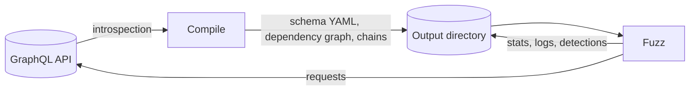

<p align="center">
  
</p>

<p align="center"><strong>The dependency-aware GraphQL API security testing tool</strong></p>

<p align="center">
<a href="https://pypi.org/project/GraphQLer/"></a>
<a href="https://hub.docker.com/r/omar2535/graphqler"></a>
<a href="https://www.python.org/downloads/"></a>
<a href="https://arxiv.org/pdf/2504.13358"></a>
<a href="https://github.com/omar2535/GraphQLer/blob/main/LICENSE"></a>
</p>

GraphQLer dynamically tests GraphQL APIs. It reads the schema through introspection, works out which queries and mutations depend on which objects, and then executes requests in dependency order — so a `createPost` runs before the `updatePost` that needs its ID. The objects returned along the way are reused in later requests and fed to a suite of security detectors.

[Get started :material-arrow-right:](installation.md){ .md-button .md-button--primary }
[View on GitHub :fontawesome-brands-github:](https://github.com/omar2535/GraphQLer){ .md-button }

## Key features

<div class="grid cards" markdown>

-   :material-file-tree:{ .lg .middle } **Dependency awareness**

    ---

    Builds a dependency graph from the schema and runs queries and mutations in their natural order.

    [:octicons-arrow-right-24: Modes](modes.md)

-   :material-code-braces:{ .lg .middle } **Request generation**

    ---

    Generates valid queries and mutations, including fragments, unions, interfaces and enums.

-   :material-database-search:{ .lg .middle } **Resource tracking**

    ---

    An *objects bucket* keeps every object seen in responses for reuse and reconnaissance.

    [:octicons-arrow-right-24: Output files](output.md)

-   :material-shield-bug:{ .lg .middle } **Vulnerability detection**

    ---

    Injection, DoS, information disclosure, IDOR and use-after-delete checks, each with a reproducible request log.

    [:octicons-arrow-right-24: Detectors](detectors.md)

-   :material-robot:{ .lg .middle } **Optional LLM assistance**

    ---

    Infer dependencies, classify IDOR/UAF chains and write a vulnerability report with any `litellm` model.

    [:octicons-arrow-right-24: LLM features](llm.md)

-   :material-console:{ .lg .middle } **CLI, TUI and MCP**

    ---

    Drive it from the command line, an interactive terminal UI, Python, or an AI assistant over MCP.

    [:octicons-arrow-right-24: Interactive TUI](tui.md)

</div>

## At a glance

```sh
pip install GraphQLer
python -m graphqler --mode run --url https://example.com/graphql --auth 'Bearer <TOKEN>'
```

GraphQLer works in two phases connected by files on disk:



1. **Compile** — introspect the schema, resolve dependencies, draw the dependency graph and generate fuzzing chains.
2. **Fuzz** — execute the chains, track objects, run detectors and record results.

## Demo

<video src="https://github.com/user-attachments/assets/0c0595a7-d0d9-4554-998a-98d6ebd1fbc2" controls width="100%"></video>

## Citation

If you use GraphQLer in research, please cite the [paper on arXiv](https://arxiv.org/abs/2504.13358) or the software via [`CITATION.cff`](https://github.com/omar2535/GraphQLer/blob/main/CITATION.cff).
