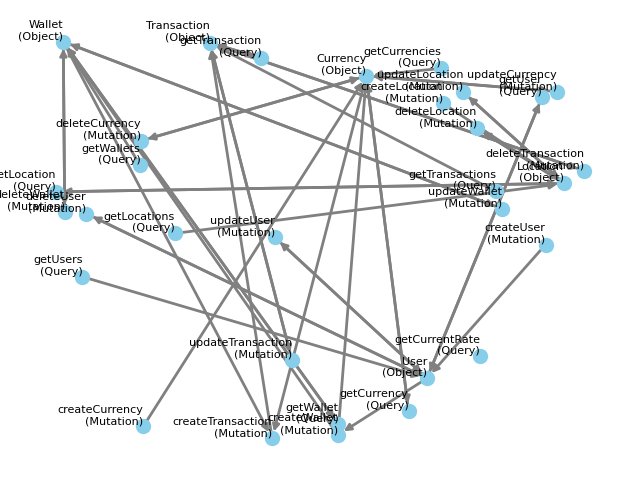

# Output files

Everything is written under `--path` (default `graphqler-output`):

```text
graphqler-output/
├── config.toml                  # resolved configuration for this run
├── introspection_result.json    # raw introspection response
├── extracted/                   # parsed schema: queries, mutations, objects, enums, …
├── compiled/
│   ├── compiled_queries.yml
│   ├── compiled_mutations.yml
│   ├── compiled_objects.yml
│   ├── compiled_subscriptions.yml
│   └── chains/
│       ├── regular.yml          # dependency-ordered fuzzing chains
│       ├── idor.yml             # IDOR candidate chains (with a secondary token)
│       └── uaf.yml              # use-after-delete candidate chains
├── dependency_graph.png         # visualised dependency graph
├── stats.txt / stats.json       # coverage, status codes, vulnerabilities
├── objects_bucket.txt           # objects collected while fuzzing
├── unique_responses.txt         # distinct responses seen
├── endpoint_results/            # per-endpoint results (SAVE_ENDPOINT_RESULTS)
├── detections/                  # one folder per finding
├── logs/
│   ├── compiler.log
│   ├── fuzzer.log               # every request and response
│   ├── detector.log
│   ├── idor.log
│   └── chain_logs/
├── serialized/                  # pickled stats and objects bucket
├── eval/                        # LLM resolver comparison, when enabled
└── report.md                    # LLM vulnerability report (--llm-report)
```

## Compiled files

The files under `compiled/` are human-readable YAML and can be edited before running `--mode fuzz`. Nodes whose dependencies could not be resolved are marked as `UNKNOWNS`; you may fill them in manually, otherwise they are fuzzed without a dependency chain. Regenerate chains after edits with `--mode compile-chains`.

## Dependency graph



## Detections

Each confirmed or potential vulnerability gets its own folder:

```text
detections/<VULNERABILITY>/<NODE>/
├── summary.txt   # vulnerability, status, evidence, final payload and response
└── raw_log.txt   # full request/response chain
```

For chain-based findings (`IDOR_CHAIN`, `UAF_CHAIN`), `summary.txt` lists every chain step with the profile it ran under, plus the chain's reason and confidence.
