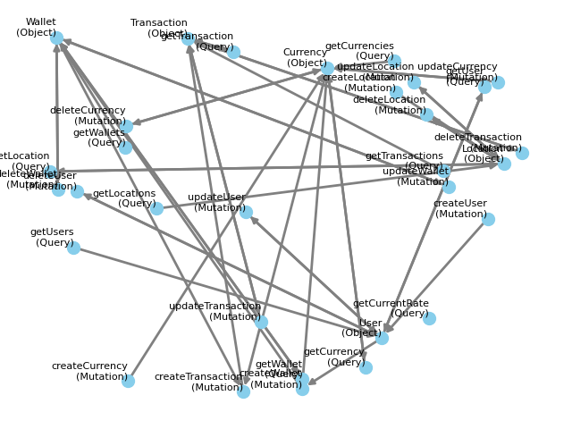

# GraphQLer

<p align="center">
  
</p>

[](https://codeclimate.com/github/omar2535/GraphQLer/maintainability)
[](https://codeclimate.com/github/omar2535/GraphQLer/test_coverage)
[](https://github.com/omar2535/GraphQLer/actions/workflows/tests.yml)
[](https://github.com/omar2535/GraphQLer/actions/workflows/lint.yml)

A stateful GraphQL API fuzzer with many inspirations from [Microsoft's RESTler fuzzer!](https://github.com/microsoft/restler-fuzzer)

## ⚒ Setup

**Pre-requisites:**

- **Windows users** will need to have VCC14 or higher. Get it at the [microsoft page](https://visualstudio.microsoft.com/visual-cpp-build-tools/)
- Make sure to have **python 3.11** or higher already installed

**Setting up the environment:**

```sh
# Creating the virtual environment
python3 -m venv .venv

# Activating the virtual environment
source .env/bin/activate
```

**Installing dependencies:**

```sh
(.env) pip install -r requirements.txt
```

**Setting up pre-commit hooks:**

```sh
(.env) pre-commit install
```

## ▶ Usage

Below will be the steps on how you can use this program to test your GraphQL API. The usage is split into 2 phases, **compilation** and **fuzzing**.

- **Compilation mode**:This mode is responsible for running an *introspection query* against the given API and generating the dependency graphh
- **Fuzzing mode**: This mode is responsible for traversing the dependency graph and sending test requests to the API

A third mode is also included for ease of use, called **run** mode. this mode compiles both the compilation and fuzzing mode into one single command.

### Compile mode

```sh
(.env) python main.py --compile --url <URL> --path <SAVE_PATH>
```

### Fuzz mode

```sh
(.env) python main.py --fuzz --url <URL> --path <SAVE_PATH>
```

### Run mode

Runs both the Compile mode and Fuzz mode

```sh
(.env) python main.py --run --url <URL> --path <SAVE_PATH>
```

## 🔎 Sample graph

This graph is an example of the dependency graph generated during compilation run

<p align="center">
  
</p>
